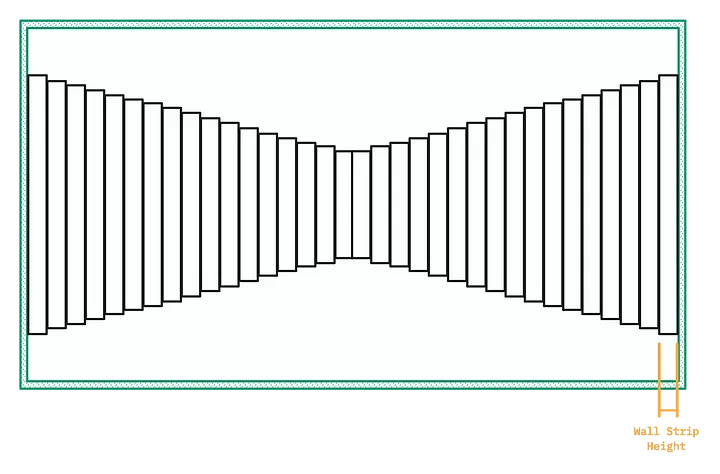

# cub3D
Project : 3D graphical representation of the inside of a maze from a first-person perspective using Ray-Casting.

* [Game Loop](#Game_Loop)
* [Handle movement of the player](#Handle_movement)
* [Raycasting](#Raycasting)
* [Rendering](#Rendering)
* [Features](#Features)

## Features

We have implemented features in our game to enhance its aesthetics, realism and playability:
- You can move the player forward by pressing the key `W`, forward with `S`, to the right with `D` and to the left with `A`.
- You can rotate the field of view by pressing `←` and `→`, or with the mouse.
- A minimap! If you press the key `M` or `↑` and then move the player a map of the maze will appear, also indicating the player's current position. Press again `M` or `↑`, move and the minimap will be removed from the screen.
- You can configure the map file as you wish, modifying the maze, floor and ceilling color and the textures path. As long as you respect the editing rules!

## Game Loop

Before launching the game we need to initialize our data. If any error occurs during the initialization, the program prints an explicit error message and quits properly.

First of all we need to declare a pointer `mlx` and initialize it to keep the connection with the `MLX Library`, we'll need it for most of the functions during the program.

After that we call the function `init_textures(&game)` to download the textures (xpm format) and store them in a tab. Every cell of the texture's tab contains a struct with all the data about the image, like its pointer but also its width, how many bits per pixel etc.

Finally we can create a new window and fill in its width and height (which are constant value for the screen).

Then the game loop can start.
```
int	game_loop(t_maze *game)
{
	if (render_one_frame(game, true) == MLX_ERROR)
		return (MLX_ERROR);
	mlx_hook(game->win, 17, 0, exit_program, game);
	mlx_hook(game->win, KeyPress, KeyPressMask, &key_press, game);
	mlx_hook(game->win, KeyRelease, KeyReleaseMask, &key_release, game);
	mlx_hook(game->win, MotionNotify, PointerMotionMask, &mouse_move, game);
	mlx_loop_hook(game->mlx, &update_player_pos, game);
	mlx_loop(game->mlx);
	return (SUCCESS);
}
```
Here we use functions that constantly wait for events (inputs or signals) and when they intercept one, redirect it to the appropriate function to handle the event.
This is the job of functions `mlx_hook()`, `mlx_loop_hook()` and `mlx_loop()`.

More concretely the game loop : 
- waits for a key to be pressed, and when this is the case modify to true the boolean variable associated with the key.
- waits for a key to be released, when this the case modify to false the boolean variable associated with the released key.
- waits for a movement of the mouse in certain areas of the screen, and then modify the rotation of player's view angle.
- another function constantly checks which key has been pressed (i.e which is currently assigned to true) to modify game values, like player position and orientation (view direction).
- the last function is the global and main loop of the game.

When the key `ESC` is pressed or when the window is closed the program should free the data on the heap and ends properly.

*Here is useful documentation to help understanding this section more deeply*\
[Tutorials mlx](https://gontjarow.github.io/MiniLibX/)\
[Documentation mlx](https://harm-smits.github.io/42docs/libs/minilibx/getting_started.html)

## Handle movement

We update the coordinates of the player in the maze with the function `update_player_pos()`, depending on inputs we call the function `move_player()` or `rotate_player()`.

- For example, in the case where the key pressed was the "W", the player wants to move forward. So in function `move_player()` to update player's position we need to calculate cos and sin of the player's current angle of view. Then we multiply the angle with the player's speed (constant value) and add it to the old coordinates.
```
new_pos.x = (x_angle * PLAYER_SPEED) + player_pos.x;
new_pos.y = (y_angle * PLAYER_SPEED) + player_pos.y;
```
After that we need to check that the new position is not in a cell of the map where there is wall, to establish a ***collision***, if that's the case we don't update the position. To ensure that the collision is respected, we need to check every corner and edge of the cell.

- For the rotation we simply add the value of the rotation speed (still constant value) to the current looking angle.

Everytime an input is intercepted and handled correctly, the program perform raycasting again and update the image on the screen.

## Raycasting

To ***render one frame*** the procedure is as follows :
- Before puting a new image on the screen, if an image is already on the screen we must destroy it with the function `mlx_destroy_image(game->mlx, game->img.img)`
- We create a new image using mlx functions. For now the image is empty.
- During the raycasting process, each time a wall slice is detected, we print the pixels corresponding to the wall on our empty image.
- Once raycasting has completed the entire image, we can display the image on the screen by using the function `mlx_put_image_to_window(game->mlx, game->win, img.img, 0, 0)`

*We will describe the logic and procedure of raycasting, without going into too much detail as there is already a vast amount of documentation on the subject.*
This is the racasting loop.
```
void	raycasting(t_maze *maze)
{
	t_vector	wall_point;
	double		current_angle;
	double		distance;
	double		wall_height;
	int		x;

	current_angle = maze->player.looking_angle - (FOV_RADIANS / 2.0);
	x = 0;
	while (x < WIDTH)
	{
		current_angle = normalize_angle(current_angle);
		wall_point = find_wall_point(maze, current_angle);
		distance = get_wall_distance(maze->player.pos, wall_point, normalize_angle(maze->player.looking_angle), current_angle);
		wall_height = (TILE_SIZE / distance) * maze->plane_distance; // reminder plane_distance = (WIDTH / 2) / tan(FOV_RADIANS / 2)
		draw_wall(maze, setup_texture(maze, wall_point, current_angle), wall_height, x);
		current_angle += (FOV_RADIANS / (double)WIDTH);
		x++;
	}
}
```

We want to produce a 3D immersive first-person view and we are given a 2D map showing the *x* , *y* coordinates of each object (mostly walls here), coordinates of the player and its angle of view.

To do so, from the player's position we'll cast rays covering its entire ***field of view*** (**FOV**). These rays will allow us to measure the ***distance*** between the walls and the player. This information will help us to determine the height of the wall we're facing. A wall is at a great distance from me, if I draw this wall it will appear very small, but if I'm very close to it, its height will seem much greater. Progressively this will create perspective.



- We cast as many rays as there are pixel columns in our screen. And the angle of the ray is incremented with each turn of the loop to cover the entire FOV.
  Keep in mind that for each turn of the loop we try to draw vertically, just a slice of wall, it means for each *x* of the screen's width we want to find the height of the wall.
- Now let's visualize the 2D map grid and rays as lines. From the player's position, the ray will gradually iterate a certain distance and examine whether the cell it's passing through is a wall or not.
	- To do this, we'll check the intersection points of the ray with the horizontal grids, then with the vertical grids. When the intersection point hits a grid that is part of a wall's cell, the function returns the *x* , *y* coordinates of this point. Then we compute the distance between the player and the point, compare the distance on the horizontal and the one on the vertical and keep the closest point to the player.
 	- Our ray has found the wall and we've been able to calculate the distance, but we need to correct the distance value as it is distorded by the fisheye effect of calculating the angle with the field of view.
    - Finally, we can use the distance to deduce the height of the wall and draw it using the function `draw_wall()`

*Here is useful documentation to help understanding this section more deeply*\
[Lode's Tutorial - using vector and camera](https://lodev.org/cgtutor/raycasting.html)\
[Raycasting tutorial with different level](https://github.com/vinibiavatti1/RayCastingTutorial/wiki)\
[Story and main logic](https://xitog.github.io/dgx/passetemps/tech_raycasting_fr.html)\
[Description of the steps with schema](https://guy-grave.developpez.com/tutoriels/jeux/doom-wolfenstein-raycasting/)

## Rendering

This part draws on the screen every slice of wall identified by the raycasting. To do this, we'll need to find the right pixel ratio for the texture to be displayed. In other words, we need to scale the information we have on the wall slice (coordinates, height...) with the texture information (width, height...).
- Firstly, we need to establish the orientation of the wall we're drawing: is it a north, south, east or west-facing wall ? Because we have in memory a texture for each wall orientation.
- Next we determine the x-coordinate of the texture based on whether the wall intersection occurred horizontally or vertically. The calculation involves scaling the wall intersection coordinate by the ratio of the texture's width to the tile size and then applying the modulus operation to ensure the result wraps around within the texture's width. This ensures that the texture coordinates are correctly mapped, even if the wall intersection point lies outside the bounds of the texture.\
The function then adjusts the x-coordinate based on the direction of the wall relative to the ray's angle. This ensure that the texture won't be flipped depending on wall orientation.
```
if (horizontal_point)
	texture->x = fmodf(wall_point.x * ((double)texture->width / TILE_SIZE), (double)texture->width);
else
	texture->x = fmodf(wall_point.y * ((double)texture->width / TILE_SIZE), (double)texture->width);
if (texture->x < 0)
	texture->x += (double)texture->width;
if ((horizontal_point && get_horizontal_direction(angle) != facing_up) || (!horizontal_point && get_vertical_direction(angle) == facing_left))
	texture->x = (double)texture->width - texture->x;
```
- Then initializes the texture's y coordinate to the appropriate starting position, scaled to match the wall's position on the screen.
- Calculate the scaling factor for mapping the texture to the wall slice. This factor is derived by dividing the texture's height by the wall height. It ensures that the texture is stretched or compressed appropriately to fit the wall slice. The texture's y coordinate is incremented by the scaling factor to move to the next row of the texture.
- The main drawing loop iterates from the starting y-coordinate to the ending y-coordinate. For each pixel in this range, the function retrieves the color of the corresponding pixel from the texture using `get_px_color()`. It then applies shading to the color using `shading_color()`, which likely adjusts the darkness based on the wall's height and the screen's height to simulate lighting effects.
```
void	draw_wall(t_maze *maze, t_img texture, double wall_height, int x)
{
	int		current_y;
	int		end_y;
	int		px_color;
	double	scale;

	current_y = (HEIGHT / 2) - (wall_height / 2);
	if (current_y < 0)
		current_y = 0;
	end_y = (HEIGHT / 2) + (wall_height / 2);
	if (HEIGHT < end_y)
		end_y = HEIGHT;
	scale = (double)texture.height / (wall_height - 1);
	draw_ceilling(maze, x, current_y);
	texture.y = ((double)current_y - ((HEIGHT / 2) - (wall_height / 2))) * scale;
	while (current_y < end_y)
	{
		px_color = get_px_color(texture, texture.x, texture.y);
		px_color = shading_color(px_color, wall_height, HEIGHT);
		if (px_color > 0)
			my_mlx_pixel_put(&(maze->img), x, current_y, px_color);
		texture.y += scale;
		current_y++;
	}
	draw_floor(maze, x, end_y);
}
```
- The function calls `draw_floor()` and `draw_ceilling()` so the entire vertical column of the screen is filled.

*Here is useful documentation to help understanding this section more deeply*\
[Understand how to draw pixels on the image](https://gontjarow.github.io/MiniLibX/mlx-tutorial-create-image.html)\
[Understand all the calculation of this part](https://medium.com/@rtailidounia/raycasting-in-cub3d-42-network-project-a-practical-tutorial-using-vectors-68eeb16b3de2)\
[Understand the scaling of the texture](https://ismailassil.medium.com/ray-casting-c-8bfae2c2fc13)\
[Understand the pixel map](https://reactive.so/post/42-a-comprehensive-guide-to-cub3d/)
